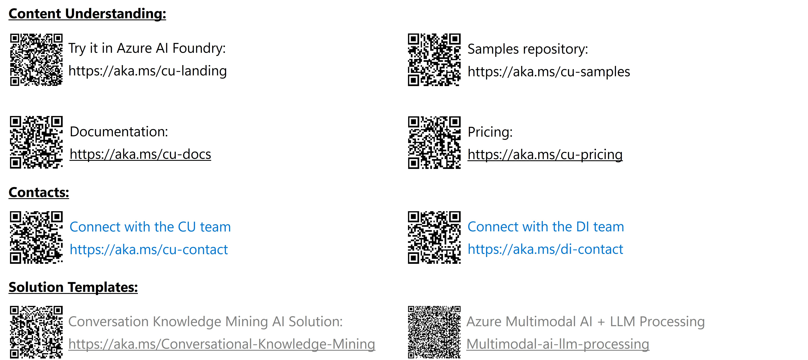

# Azure AI Document Intelligence & Content Understanding Expert Booth Material
This is the main folder for Azure AI Document Intelligence and Azure AI Content Understanding content for BUILD '25.

## Recently announced features or updates

### Document Intelligence
-- [Documentation](https://learn.microsoft.com/en-us/azure/ai-services/document-intelligence/?view=doc-intel-4.0.0)
-- Batch API
-- Read/Prebuild/Custom models

### Content Understanding
- Pro mode ...
-

The following slides can be used at the booth: [slides_placeholder.pptx](./slides_placeholder.pptx)

## Booth Content

- (Overview Slides)[./Azure AI Document Intelligence\Build 25 Content Understanding Expert Booth.pptx]
- (FAQ for BUILD '25)[./faq.md]

## Quick Links to share

## Demos

### Content Understanding

Content Understanding can be presented either through [Foundry Portal](https://ai.azure.com) or via the provided python samples repos.

***Prerequisites:***
- Please make sure you have access to a subscription and have permissions to create resources and add role assignments.
- Ideally have an AI Services/HUB resource setup prepared.

#### Foundry Portal Demo Standard Mode Happy Path

***Create Content Understandind task***
1. Go to the **[Content Understanding Landing Page](https://int.ai.azure.com/explore/aiservices/vision/contentunderstanding)**.
1. Click **Select or create a project** button
1. Either select an existing project or create a new one
1. Project should open on the 'Content Understanding / Custom task' page and the 'Create a new task' wizard should open
1. Fill out the 'Create a new task' settings and create

***Setup and test task analyzer***
1. The task will open on the 'Define schema' page
1. Upload one of the sample files
1. Service will provide a selection of templates suitable to the modality
1. Select template and hit **Create** button
1. On the schema editor page either continue with template schema or show modifications
1. Hit **Save** button to save the schema which will lead you to the 'Test analyzer' page
1. Hit **Run analysis** on the 'Test analyzer' page to invoke processing
1. Upload more files as you like
1. To make the analyzer available for inferencing go to 'Build analyzer' section and hit **+ Build analyzer** button
1. You can also open the analyzer after creation and show the analyzers schema, Test the deployed version and get code examples

Feel free to show any of the advanced settings on the Content Understanding task as you feel comfortable.

#### Python Samples

The following sample repos provide ready to use sample notebooks for preview.1 API status.
They can easily be run locally or in Github codespaces.

[Azure Content Understanding General Samples](https://github.com/Azure-Samples/azure-ai-content-understanding-python)

[Azure Search with Content Understanding](https://github.com/Azure-Samples/azure-ai-search-with-content-understanding-python)

[Azure Content Understanding with OpenAI](https://github.com/Azure-Samples/azure-ai-content-understanding-with-azure-openai-python)

#### Sample Data

You can find sample data for all modalities in the [data](./data/) folder.

## Learning Resources incl. Videos

[Document Intelligence Documentation](https://learn.microsoft.com/azure/ai-services/document-intelligence)

[Content Understanding Documentation](https://learn.microsoft.com/azure/ai-services/content-understanding/)

[Learn Video Series - Multimodal data processing with Azure AI Content Understanding](https://learn.microsoft.com/en-us/shows/multimodal-data-processing-with-azure-ai-content-understanding/)

[Learning Path - Analyze content with Azure AI Content Understanding](https://learn.microsoft.com/training/modules/analyze-content-ai/)

## Blogs

[Preview.2 Announcement Blog](TBD Monday)

[Learn Video Series - Announcement Blog](https://techcommunity.microsoft.com/blog/Azure-AI-Services-blog/introducing-azure-ai-content-understanding-for-beginners/4413071)
